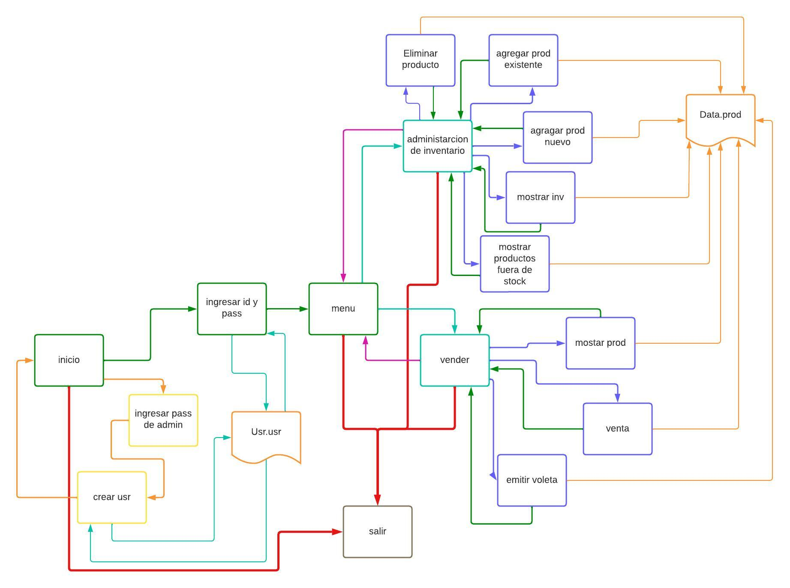

# FundProg2Final

  

## **Aplicativo por terminal para Ferreteria**
Este programa es una herramienta que desarrollamos para facilitar la gestión de inventario y ventas en un negocio de Ferreteria en el lenguage c++, aplicando lo aprendido en clase como listas dinamicas, manipulacion de archivo y estructuras.

### Progreso
#### Jhon(getion de inventario)
- [x] interfaz de menu
- [x] interfaz de administracion de inventario 
- [x] funcion mostrar el inventario
- [x] funcion agregar nuevo producto a inv
- [x] funcion agregar producto con id
- [x] funcion mostrar productos que no superan el stock minimo
- [x] funcion eliminar producto 
#### Saidh(venta de producto)
- [x] funcion venta
- [x] funcion mostrar productos 
- [x] funcion voleta de venta
- [x] interfaz venta 
- [x] interfaz vender 
#### Dayana(gestion de ususarios y permiso de acceso)
- [x] interfaz de inicio
- [x] funcion crear usuario
- [x] funcion ingresar
- [x] interfaz de peticion de contraseña de admin
- [x] intrefaz de ingreso de id y contraseña
- [x] interfaz de creacion de usuario 
### imagen de estructura del aplicativo

 

